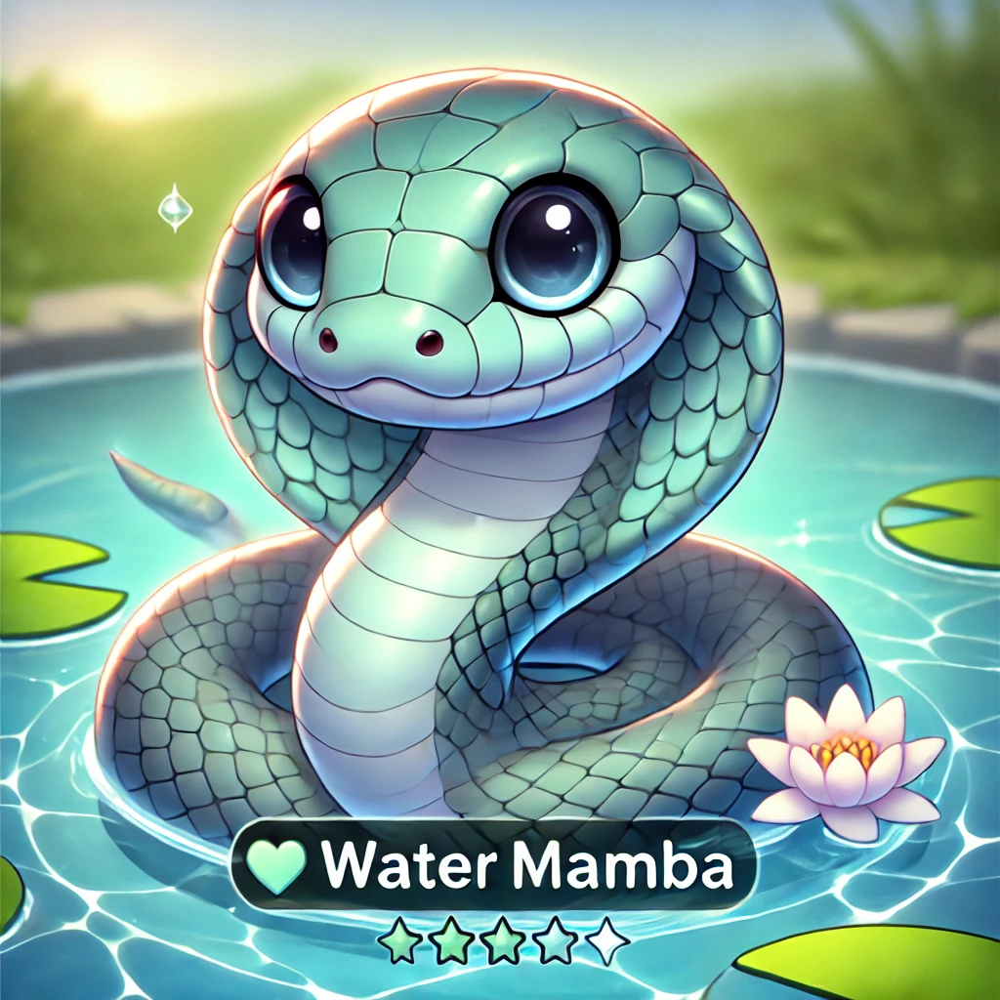
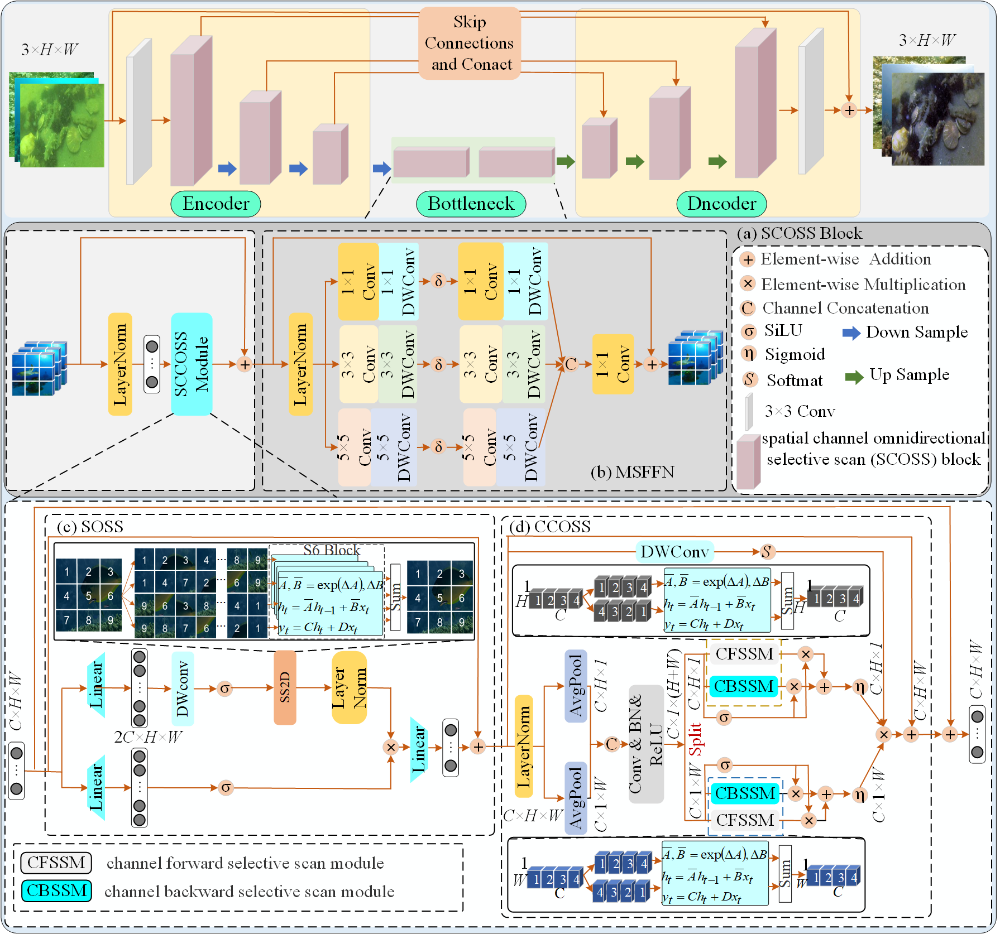

# WaterMamba: Visual State Space Model for UnderWater Image Enhancement
Meisheng Guan, Haiyong Xu, Gangyi Jiang, Mei Yu, Yeyao Chen, Ting Luo and Yang Song

[](https://arxiv.org/abs/2405.08419)

<p align="center">
    
</p>

<hr />

> **Abstract:** Underwater imaging often suffers from low quality and lack of ffne details due to various physical factors affecting light propagation, scattering, and absorption in water. To improve the quality of underwater images, some underwater image enhancement (UIE) methods based on convolutional neural networks (CNN) and Transformer have been proposed. However, CNN-based UIE methods are limited in modeling long-range dependencies and are often applied to speciffc underwater environments and scenes with poor generalizability. Transformer-based UIE methods excel at longrange modeling, which typically involves a large number of parameters and complex self-attention mechanisms, posing challenges for efffciency due to the quadratic computational complexity of image size. Considering computational complexity and the severe degradation of underwater images, the state space model (SSM) with linear computational complexity for UIE, named WaterMamba, is proposed. Considering the challenges of non-uniform degradation and color channel loss in underwater image processing, we propose a spatialchannel omnidirectional selective scan (SCOSS) blocks consisting of the spatial-channel coordinate omnidirectional selective scan (SCCOSS) modules module and a multi-scale feedforward network (MSFFN). The SCOSS block effectively models pixel information ffow in four directions and channel information ffow in four directions, addressing the issues of pixel and channel dependencies. The MSFFN facilitates information ffow adjustment and promotes synchronized operations within SCCOSS modules. Extensive experiments on four datasets showcase the cutting-edge performance of the WaterMamba while employing reduced parameters and computational resources. The WaterMamba outperforms the state-of-the-art method, achieving a PSNR of 24.7dB and an SSIM of 0.93 on the UIEB dataset. On the UCIOD dataset, the WaterMamba achieves a PSNR of 21.9dB and an SSIM of 0.84. Additionally, the UCIQE of the WaterMamba on the SQUID dataset is 2.77, while the UIQM is 0.56, which further validated its effectiveness and generalizability. The code is publicly available at: https://github.com/Guan-MS/WaterMamba

<hr />

### Network Architecture


### Dependencies and Installation

This codebase was tested with the following environment configurations. It may work with other versions.

- Ubuntu 20.04
- CUDA 11.7
- Python 3.10
- PyTorch 2.0.1 + cu117

### Previous installation

To use the selective scan with efficient hard-ware design, the `mamba_ssm` library is needed to install with the folllowing command.

```
pip install causal_conv1d==1.0.0
pip install mamba_ssm==1.1.1
```


### Pre-trained Model

If this paper is accepted, we will publish the code for the main framework.

The pre-trained model can be downloaded from [here](https://drive.google.com/file/d/12C79STSpZNIuJ70jE8ayNafw3UdcSkq6/view?usp=sharing), and its corresponding config file is [this yaml](./Mamba/Options/WaterMamba.yml).

### Preparing datasets

### Datasets:

(1) UIEB (UIE): [Data](https://li-chongyi.github.io/proj_benchmark.html)

(2) SQUID (UIE): [Data](https://csms.haifa.ac.il/profiles/tTreibitz/datasets/ambient_forwardlooking/index.html)

(3) UICoD (UIE): [Data](https://github.com/TrentQiQ/UVE-38K)

(4) U45(UIE): [Data](https://github.com/IPNUISTlegal/underwater-test-dataset-U45-/tree/master/upload/U45)


To make use of the [test.py](./Mamba/test.py) and the files in [Mamba/](./Mamba/test.py), the dataset folder names should be lower-case and structured as follows.

```
WaterMamba
├─ other files and folders
├─ dataset
│  ├─ demo
│  │  ├─ train
│  │  │  ├─ input
│  │  │  │  ├─ fig1.png
│  │  │  │  ├─ ...
│  │  │  ├─ target
│  │  │  │  ├─ fig1.png
│  │  │  │  ├─ ...
│  │  ├─ test
│  │  │  │  ├─ ...
```

## Training
To make use of the [train.py](./basicsr/train.py)

## Citation

If you use Restormer, please consider citing:

    @article{guan2024watermamba,
      title={WaterMamba: Visual State Space Model for Underwater Image Enhancement},
      author={Guan, Meisheng and Xu, Haiyong and Jiang, Gangyi and Yu, Mei and Chen, Yeyao and Luo, Ting and Song, Yang},
      journal={arXiv preprint arXiv:2405.08419},
      year={2024}
    }


## Contact

Should you have any question, please contact 1971306417@qq.com

**Acknowledgment:** This code is based on the [Restormer](https://github.com/swz30/Restormer). 

